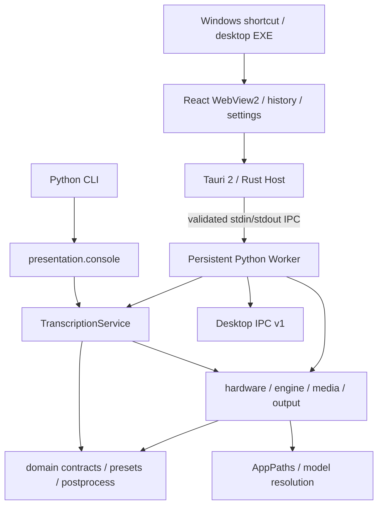

# 当前工程状态

状态日期：2026-07-16。

## Git 基线

- 分支：`master`。
- 当前已提交 HEAD：`dc2828824369b56ccc0fb537350700d518683cfc`。
- 提交信息：`docs: consolidate project records and architecture handoff`。
- 模块化代码基线：`0b3a28943cf87d4ecdad78943081e1604e091dd7 refactor: establish modular architecture baseline`。
- 工作区包含已经验收但尚未提交的新架构批次 0–6 成果，以及正在等待用户最终验收的批次 7 正式切换与 PyQt5 退役成果；未经用户要求不自动提交。

用户本地状态曾包含 `.claude/settings.local.json`、`.workbuddy` memory 和原 `Requirement/isolate.md`；它们不属于常规架构改造范围。每次接手都应重新运行 `git status --short`，不要依赖本快照判断工作区是否干净。

注意：三份受跟踪的需求原文已按 Git blob 完整恢复并迁入 `Log/90-原始需求/`；未跟踪的 `isolate.md` 因回收站对象随后被清除而无法恢复，等待用户重新提供。

## 当前技术栈

| 范围 | 当前实现 |
| --- | --- |
| 语言 | Python 3.10+；当前验证环境为 Python 3.14.2 |
| 推理 | faster-whisper 1.2.1 / CTranslate2 |
| GPU | NVIDIA CUDA 12、`nvidia-cublas-cu12`、NVML |
| 正式 GUI | Tauri 2.11.x + React 19.2.7 + TypeScript 6.0.3 WebView2；真实 Worker bridge、持久化任务工作台和真实性能趋势 |
| CLI | argparse + console script + `python -m whisper_subtitle`；保留 `transcribe/check/worker` |
| 进程协议 | Tauri Host → Desktop IPC v1 stdin/stdout JSON-lines → 常驻 Worker；CLI 可独立转录 |
| 测试 | pytest `235 passed`；Vitest `8 passed`；Playwright `3 passed`；Rust fmt/clippy/test 通过 |
| 构建 | setuptools / `pyproject.toml`；pnpm/Vite；Cargo/Tauri |
| 运行形态 | Tauri EXE/Windows 快捷方式、wheel/prefix CLI、NSIS current-user 离线安装介质、完整便携目录 |

## 当前架构

主要代码位置：

- `src/whisper_subtitle/domain/`：业务契约、preset、后处理和引擎协议。
- `src/whisper_subtitle/application/transcribe.py`：单一转录应用服务。
- `src/whisper_subtitle/infrastructure/`：CUDA、硬件、媒体、输出和引擎适配器。
- `src/whisper_subtitle/presentation/`：保留 CLI 文本/JSONL 展示；PyQt5 子包已退役。
- `src/whisper_subtitle/protocol/`：Desktop IPC v1 消息、解析、错误映射和任务事件序列校验。
- `src/whisper_subtitle/worker/`：stdin/stdout 传输、任务队列、模型缓存、取消和异常隔离。
- `contracts/desktop_ipc/v1/`：跨语言 JSON Schema 和协议说明。
- `src/whisper_subtitle/paths.py`：安装与便携路径解析。
- `src/whisper_subtitle/cli.py`：统一 CLI。
- `apps/web/`：React/TypeScript 表现层、设计 token、typed mock/Tauri bridge 和真实任务工作台。
- `apps/desktop/`：Tauri/Rust WebView 宿主、严格协议校验、原生能力、受限文本预览和 Worker 监管。

详细规则见 [`docs/architecture/current_architecture.md`](../../docs/architecture/current_architecture.md)。

## 当前验证结果

最近一次只读复核：

| 验证 | 结果 |
| --- | --- |
| Python | 3.14.2 |
| `pip check` | No broken requirements found |
| 环境自检 | 通过 |
| pytest | `235 passed` |
| Worker 专项 | `10 passed in 0.15s` |
| 全新 wheel 环境 | Python 3.14.2；自检与 `pip check` 通过 |
| 真实 Worker GPU | 全新 wheel 环境；RTX 5070 Ti；中文 Host 输出与既有 golden 一致；真实 CPU/内存/GPU/显存采样通过 |
| 前端门禁 | 本批文件 Prettier、ESLint、TypeScript strict、Vitest 8/8、Playwright 3/3、Vite production build 通过 |
| Rust/Tauri | Rust 1.97.0；rustfmt、Clippy、Cargo test `9 passed`、Tauri `--no-bundle` production build 通过 |
| WebView2 冒烟 | production EXE 创建/正常关闭通过；TCP 监听端口 0；退出码 0；剩余 Worker 进程 0 |
| 批次 6 发布介质 | PyInstaller onedir Worker、NSIS offlineInstaller、完整便携目录、manifest、SHA-256、CycloneDX Python SBOM 生成通过 |
| 发布态真实 GPU | 安装版与便携版冻结 Worker 均以 CUDA/float16 连续完成 cn/cn2；只加载 1 次模型；输出哈希与 golden 一致 |
| 安装/升级/卸载 | 0.1.0 安装、临时 0.1.1 覆盖升级、最终卸载通过；安装目录完全移除，WebView 用户数据保留 |
| 批次 7 正式切换 | 安装版/便携版 Tauri EXE 直接启动；0 Python、0 监听；PyQt5 与 VBS 均退出正式入口和发布依赖 |

批次 10 发布验证还包括：

- 四 preset benchmark：24/24 通过。
- 固定中文 cn/cn2 与 golden 完全一致。
- 干净 wheel 无旧 core/gui。
- 从零依赖安装约 1.305 GiB。
- 安装版真实 CUDA 转录通过。
- 历史 PyQt5 GUI offscreen 和 VBS 入口曾通过；当前以批次 7 安装版/便携版 Tauri EXE 实机结果为准。

## 当前优势

- 转录主流程唯一，preset 不再绑定物理脚本。
- 纯业务规则与具体推理库已分离。
- 输出使用同目录临时文件与原子替换。
- 安装路径和便携路径均有测试。
- 真实音频、golden、benchmark 和架构门禁已形成安全网。
- 新 UI 可以复用现有 application/domain/infrastructure，而不必重写推理算法。
- Desktop IPC v1 已有真实常驻 Worker 消费者，连续任务可以复用模型。
- 多输入、派生参数和 TXT/Markdown 输出策略已在 Python 边界冻结并再次校验。
- Tauri/React 桌面表现层已接入真实 Worker、原生路径能力和任务生命周期，且不依赖浏览器或本地服务端口。
- 新界面已具备版本化设置、最近 100 条任务历史、失败重试、参数快照、受限输出预览和 60 点真实性能趋势。
- 发布态 Tauri Host 已使用相邻冻结 Worker 和直接模型快照，不依赖目标机 Python/Node/Rust，也不启动本地服务端口。
- 两部分离线安装介质与完整便携目录均已生成；安装、覆盖升级和卸载有真实验证记录。

## 当前技术债

- application 默认组合仍直接依赖具体 infrastructure，端口倒置尚不完整。
- CLI JSONL 进度事件仍携带中文和 emoji 展示文本；Desktop IPC v1 Worker 已机器化，两条通道服务不同入口。
- `pyproject.toml` 与 `requirements.txt` 仍存在手工重复声明。
- 尚无锁文件、Ruff、静态类型门禁、覆盖率门禁和 CI 工作流。
- Tauri/React 尚无实时片段、波形、时间轴和字幕编辑；这些能力需要新增片段级数据契约与编辑输出语义。
- 当前发布产物未签名，因为没有提供代码签名证书；签名接线已实现但不能伪造完成状态。
- 自动更新仍为 P2 且未启用；当前采用已验证的 NSIS 离线覆盖升级。
- 批次 6 未在第二台物理干净 Windows 机器验证；现有证据来自同一 Windows 11 GPU 实机上的全新构建环境、冻结进程和真实安装目录。

## 不应回退的基线

- 不恢复四个旧 Core 主流程。
- 不让 preset 再绑定脚本名或模块名。
- 不让 GUI 复制转录业务逻辑。
- 不从源码层级猜测模型或运行目录。
- 不取消 golden、真实音频和 benchmark 门禁。
- 不重新引入 PyTorch 三件套，除非出现经过从零环境验证的真实必要性。
