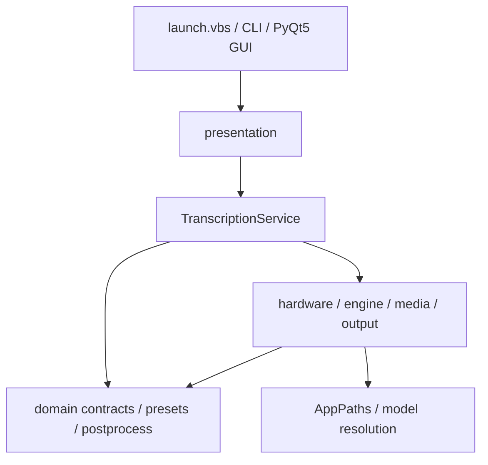

# 当前工程状态

状态日期：2026-07-13。

## Git 基线

- 分支：`master`。
- HEAD：`0b3a28943cf87d4ecdad78943081e1604e091dd7`。
- 提交信息：`refactor: establish modular architecture baseline`。
- 上一基线：`9261d97 refactor: establish tested modularization baseline`。
- 尚未推送当前提交。

用户本地状态曾包含 `.claude/settings.local.json`、`.workbuddy` memory 和原 `Requirement/isolate.md`；它们不属于常规架构改造范围。每次接手都应重新运行 `git status --short`，不要依赖本快照判断工作区是否干净。

注意：三份受跟踪的需求原文已按 Git blob 完整恢复并迁入 `Log/40-原始需求/`；未跟踪的 `isolate.md` 因回收站对象随后被清除而无法恢复，等待用户重新提供。

## 当前技术栈

| 范围 | 当前实现 |
| --- | --- |
| 语言 | Python 3.10+；当前验证环境为 Python 3.14.2 |
| 推理 | faster-whisper 1.2.1 / CTranslate2 |
| GPU | NVIDIA CUDA 12、`nvidia-cublas-cu12`、NVML |
| GUI | PyQt5 5.15.11 / Qt Widgets |
| CLI | argparse + console script + `python -m whisper_subtitle` |
| 进程协议 | GUI QProcess → canonical CLI；CLI 输出 JSONL progress |
| 测试 | pytest；当前 176 项通过 |
| 构建 | setuptools / `pyproject.toml` |
| 运行形态 | 便携环境、wheel/prefix 安装 |

## 当前架构

主要代码位置：

- `src/whisper_subtitle/domain/`：业务契约、preset、后处理和引擎协议。
- `src/whisper_subtitle/application/transcribe.py`：单一转录应用服务。
- `src/whisper_subtitle/infrastructure/`：CUDA、硬件、媒体、输出和引擎适配器。
- `src/whisper_subtitle/presentation/`：CLI 展示、PyQt5 窗口、控制器和进程管理。
- `src/whisper_subtitle/paths.py`：安装与便携路径解析。
- `src/whisper_subtitle/cli.py`：统一 CLI。

详细规则见 [`docs/architecture/current_architecture.md`](../../docs/architecture/current_architecture.md)。

## 当前验证结果

最近一次只读复核：

| 验证 | 结果 |
| --- | --- |
| Python | 3.14.2 |
| `pip check` | No broken requirements found |
| 环境自检 | 通过 |
| pytest | `176 passed in 3.15s` |

批次 10 发布验证还包括：

- 四 preset benchmark：24/24 通过。
- 固定中文 cn/cn2 与 golden 完全一致。
- 干净 wheel 无旧 core/gui。
- 从零依赖安装约 1.305 GiB。
- 安装版真实 CUDA 转录通过。
- GUI offscreen 和便携 `launch.vbs` 冒烟通过。

## 当前优势

- 转录主流程唯一，preset 不再绑定物理脚本。
- 纯业务规则与具体推理库已分离。
- 输出使用同目录临时文件与原子替换。
- 安装路径和便携路径均有测试。
- 真实音频、golden、benchmark 和架构门禁已形成安全网。
- 新 UI 可以复用现有 application/domain/infrastructure，而不必重写推理算法。

## 当前技术债

- PyQt5/Qt Widgets 的视觉、动画和 Web 组件生态不符合下一代 UI 目标。
- application 默认组合仍直接依赖具体 infrastructure，端口倒置尚不完整。
- 进度事件携带中文和 emoji 展示文本，不适合作为长期公共 IPC 契约。
- GUI 子进程每次任务结束后退出，下一次任务会重新加载模型。
- `main_window.py` 与 `widgets/panels.py` 仍偏大。
- `pyproject.toml` 与 `requirements.txt` 仍存在手工重复声明。
- 尚无锁文件、Ruff、静态类型门禁、覆盖率门禁和 CI 工作流。
- 尚无正式桌面安装器、自动更新、版本化 IPC 和任务历史存储。

## 不应回退的基线

- 不恢复四个旧 Core 主流程。
- 不让 preset 再绑定脚本名或模块名。
- 不让 GUI 复制转录业务逻辑。
- 不从源码层级猜测模型或运行目录。
- 不取消 golden、真实音频和 benchmark 门禁。
- 不重新引入 PyTorch 三件套，除非出现经过从零环境验证的真实必要性。
