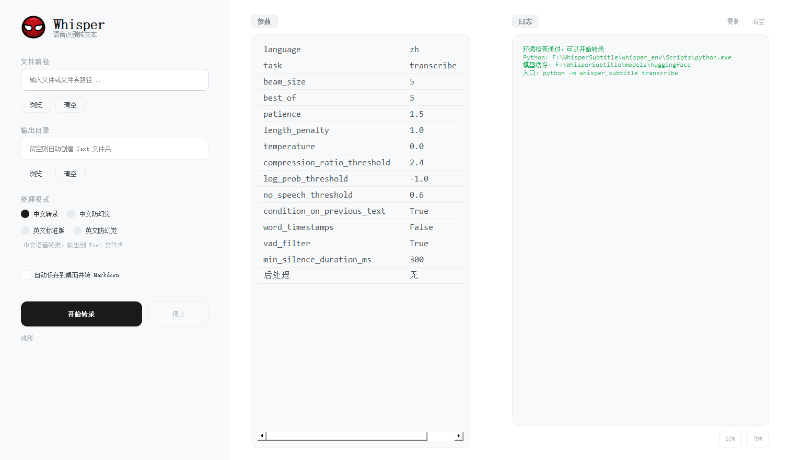
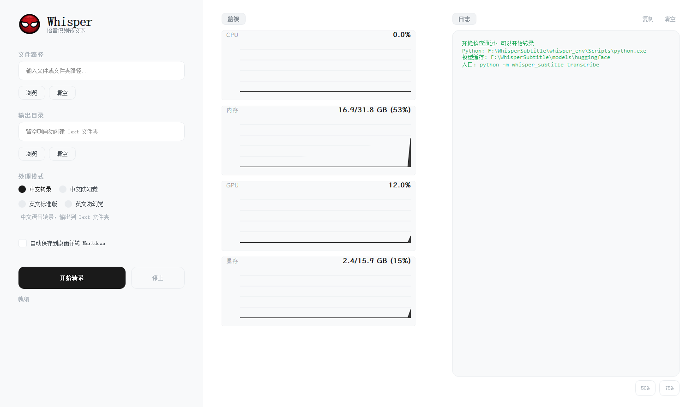

# 批次 0：当前功能与交互基线

状态：`Baseline Recorded`。

基线日期：2026-07-15。

代码基线：`0b3a289 refactor: establish modular architecture baseline`。

交接基线：`dc28288 docs: consolidate project records and architecture handoff`。

## 1. 截图基线

截图使用当前 PyQt5 生产窗口组件生成，窗口尺寸为 1512 × 882。采集时注入内存设置仓库和成功的启动检查结果，没有读取或写入用户 QSettings，没有启动转录进程。

### 参数页

SHA-256：`29D6A6607B28440F7F20973FDBED2BFFEFBC432173B086D4E6C87B67805CDF24`

### 监视页

SHA-256：`66D61757BD7D8817DEB784B99DD0F5AAB4A2F22143FCAC59440D71B2F57170A8`

监视页中的 CPU、内存、GPU 和显存数字来自采集时机器的实时状态，只用于记录图表布局，不是性能基准。

## 2. 当前用户流程

1. 启动 `launch.vbs`、`whisper-subtitle gui` 或 `python -m whisper_subtitle gui`。
2. GUI 解析安装/便携路径并执行环境检查。
3. 用户手工输入一个文件或文件夹路径，或通过“浏览”菜单选择单个文件/单个文件夹。
4. 用户可填写一个输出目录；留空时输出到每个媒体旁的 `Text` 目录。
5. 用户在四个固定 preset 中单选一个处理模式。
6. 中间参数页只读显示该 preset 的最终参数。
7. 用户可选择“自动保存到桌面并转 Markdown”。
8. 点击“开始转录”后，GUI 构造一个 `TranscriptionRequest`，通过 `QProcess` 启动 canonical CLI 和 JSONL 进度模式。
9. GUI 自动切换到性能监控页，展示 CPU、内存、GPU 和显存。
10. CLI 子进程完成、失败或被停止后，GUI恢复按钮和状态，并回到参数页。

## 3. 当前功能清单

| 范围 | 当前能力 | 当前限制 | 下一代必要映射 |
| --- | --- | --- | --- |
| 输入文本框 | 接受一个文件或文件夹路径 | 不剥离成对外引号；不能表达多输入 | 路径标准化 + `InputSource[]` |
| 文件浏览 | 选择一个支持格式文件 | 不能多选 | 原生多选并追加到输入列表 |
| 文件夹浏览 | 选择一个文件夹 | 一次只能一个 | 可追加多个目录 |
| 媒体发现 | 文件夹递归发现支持格式并排序 | 多来源之间没有统一去重/排序 | 保留目录内部递归排序，来源列表稳定去重 |
| 输出目录 | 一个可选强制输出目录 | 不能分别表达 TXT/Markdown | 兼容模式 + 类型化输出策略 |
| preset | 中文转录、中文防幻觉、英文标准、英文防幻觉 | 参数不可编辑 | 不可变 preset + 派生自定义配置 |
| 参数页 | 显示 15 个左右的有效参数/后处理信息 | 全部只读 | schema 驱动、实时校验和生效值预览 |
| 桌面输出 | 可额外写桌面 TXT 与内容相同的 Markdown | 固定桌面路径，不能独立选择 | TXT/Markdown 开关和目标策略 |
| 启动 | 校验非空和路径存在后启动 | 不接受路径列表 | 创建冻结的任务快照 |
| 进度 | JSONL `ProgressEvent` | 无 schema version；message 含展示文案 | 稳定 command/event/error code |
| 停止 | 先 terminate，5 秒后强制 kill | 粗粒度进程取消 | Worker 任务取消 + 最终进程兜底 |
| 关闭 | 运行中先请求停止，完成后关闭 | 依赖短进程生命周期 | Host 协调 shutdown/timeout/kill |
| 日志 | 展示合并输出，可复制、清空 | 协议与日志共享合并通道 | stdout 协议、stderr/文件日志 |
| 性能 | CPU、内存、GPU、显存每秒刷新 | UI 内直接访问 psutil/NVML | Worker/Host 结构化诊断事件 |
| 设置 | 保存输入、输出、preset、窗口几何 | QSettings 字段未版本化 | 版本化桌面设置和迁移 |
| 窗口 | 原生标题栏、最小化/最大化、50%/75%尺寸按钮 | 固定三栏 Qt Widgets 布局 | Tauri 窗口和响应式设计系统 |

## 4. 当前 preset 基线

| ID | CLI alias | 显示名 | 语言 | 上下文 | 后处理 |
| --- | --- | --- | --- | --- | --- |
| `cn` | `cn` | 中文转录 | `zh` | 开启 | `chinese_standard` |
| `cn2` | `cn2` | 中文防幻觉 | `zh` | 关闭 | `chinese_anti_hallucination` |
| `en_v1` | `en` | 英文标准版 | `en` | 开启 | `english_standard` |
| `en_v2` | `en2` | 英文防幻觉 | `en` | 关闭 | `english_anti_hallucination` |

四个 preset 是不可静默改变的行为基线。下一代“自定义模式”必须以其中一个 preset 为来源，不能修改全局注册表。

## 5. 当前输出基线

### 默认输出

- 输入媒体：`<media-dir>/<name>.<ext>`
- 主输出：`<media-dir>/Text/<name>.txt`

### 指定输出目录

- 主输出：`<forced-output>/<name>.txt`
- 若强制目录不同于源媒体 `Text`，仍写一份 `<media-dir>/Text/<name>.txt` 备份。

### 桌面输出选项

- `~/Desktop/Whisper语音列表/Text/<name>.txt`
- `~/Desktop/Whisper语音列表/Markdown/<name>.md`
- Markdown 当前只是与 TXT 内容相同的 UTF-8 副本。

所有现有文本输出使用同目录临时文件和 `os.replace` 原子替换。下一代输出策略必须保留原子性，并显式处理多来源同名冲突。

## 6. 当前错误与恢复路径

| 场景 | 当前反应 | 下一代等价要求 |
| --- | --- | --- |
| 缺少 PyQt5 | GUI 入口退出并报告缺失 | 新 GUI 不依赖 PyQt5；CLI/Worker 给出独立诊断 |
| 启动环境检查失败 | 日志标红并弹出 critical 对话框 | 工作台显示可操作诊断，不允许静默启动任务 |
| 输入为空 | warning 对话框 | 输入列表级校验 |
| 路径不存在 | critical 对话框 | 精确标出对应来源并允许移除/修正 |
| 格式不支持 | CLI/应用返回 `input_invalid`/失败 | 稳定错误码和支持格式数据 |
| 文件夹无媒体 | 返回支持格式列表和失败 | 目录项独立错误，不吞掉其他有效来源 |
| 模型/CUDA/环境加载失败 | 子进程非零退出，日志显示诊断 | Worker error code、stderr 日志和可重试状态 |
| 单文件转录失败 | 记录失败并继续批次其他文件 | 任务项失败，不破坏队列其余项 |
| 部分批次失败 | 批次退出码 1 | `partial_failure` 汇总和逐项结果 |
| 用户停止 | terminate，超时 5 秒 kill | 协议取消、超时升级和最终 kill |
| 子进程崩溃 | 显示异常退出码 | Worker 崩溃事件、Host 重启策略和任务状态收敛 |
| 运行时关闭窗口 | 先停止任务，完成后关闭 | `worker.shutdown`、超时和孤儿进程检查 |

## 7. 功能等价门禁

新界面在正式切换前至少必须覆盖：

- 当前文件、文件夹、输出目录、四 preset、桌面输出、开始、停止、状态、日志和性能监控。
- 当前设置恢复和窗口关闭清理。
- 当前 CLI 与 PyQt5 的主要失败路径。
- 默认四 preset 的参数、后处理、文件命名和输出内容。
- 安装模式与便携模式下的路径解析。
- golden、benchmark、真实中英文 CUDA 和批处理结果。

带引号路径、多文件输入、自定义模式和独立 TXT/Markdown 策略是新增能力，不能用它们作为删减当前基线功能的理由。
