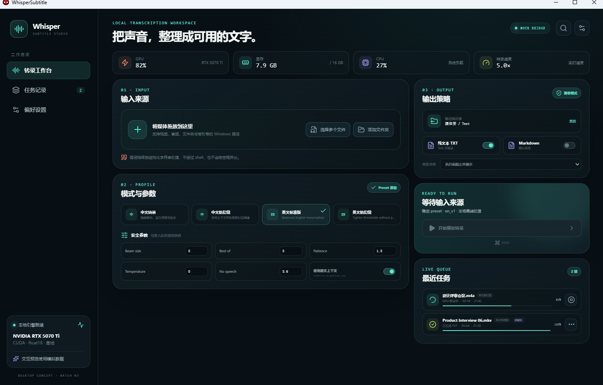

# 新架构批次 3 执行报告

状态：`Implementation Complete / User Acceptance Pending`。

执行日期：2026-07-15。

## 1. 批次边界

本批只实现：

- `apps/web` React/TypeScript WebView 表现层；
- `apps/desktop` Tauri 2 / Rust 最小桌面宿主；
- 根级 pnpm workspace、精确版本锁和 Rust 工具链锁；
- 设计 token、窗口框架、导航、输入工作台、preset/参数、输出策略、任务列表和性能卡片；
- typed `DesktopBridge` 及仅用于预览的 `MockDesktopBridge`；
- 前端测试、Rust 静态检查、Tauri 开发/生产构建和真实 WebView2 窗口冒烟。

本批明确未实现：

- 未调用、启动、连接或监管 `python -m whisper_subtitle worker`；
- 未增加 Tauri command、sidecar、shell、文件系统、对话框或网络权限；
- 未增加 localhost HTTP/WebSocket 服务，也未打开外部浏览器；
- 未改写 Python 转录、CUDA、preset、后处理、文件命名或输出内容；
- 未删除 PyQt5；
- 未制作安装器、便携包、签名、自动更新或发布产物；
- 未执行 Git 暂存、提交、建分支或推送。

以上未实现项仍分别属于批次 4、5、6、7，不能因已有 UI 预览而视为完成。

## 2. 工程结构

```text
apps/
├── web/
│   ├── src/bridge/          # 类型化 bridge + mock 实现
│   ├── src/components/      # 工作台、preset、输出、任务、性能组件
│   ├── src/contracts/       # UI 侧 DesktopBridge 类型
│   ├── src/data/            # 与 Python 基线对齐的 mock preset 展示数据
│   ├── src/state/           # Zustand 工作区状态
│   └── src/styles.css       # 离线设计 token 与响应式桌面布局
└── desktop/
    └── src-tauri/           # 最小 Rust Host、CSP、窗口与 capability
```

根目录新增：

- `.nvmrc`：Node `24.16.0`；
- `package.json#packageManager`：pnpm `10.34.5`；
- `pnpm-lock.yaml`：Node 依赖精确锁；
- `rust-toolchain.toml`：Rust `1.97.0-x86_64-pc-windows-msvc`；
- `apps/desktop/src-tauri/Cargo.lock`：Rust/Tauri 依赖精确锁。

## 3. WebView 桌面形态

Tauri 的 `frontendDist` 直接指向 `apps/web/dist`。生产和本批开发预览均加载 Vite 构建后的本地静态资源：

- 不设置 `devUrl`；
- Vite 开发脚本采用 `build --watch`，不启动开发服务器；
- CSP 明确设置 `connect-src 'none'`；
- WebView 窗口内运行 React，不需要用户访问 URL；
- 窗口进程冒烟检查得到 TCP 监听端口 `0`。

这是一层 WebView 桌面表现层，不是 WebUI 产品逻辑。

## 4. typed desktop bridge

UI 组件只依赖 `DesktopBridge` 接口：

- `selectFiles()`；
- `selectDirectory()`；
- `startTranscription()`；
- `cancelTask()`；
- `subscribe()`；
- `dispose()`。

批次 3 的绑定点固定为 `MockDesktopBridge`。它返回结构化 Windows 路径并发出 typed queued/progress/completed/cancelled/performance 事件。批次 4 可新增 Tauri adapter，而不用让组件直接依赖 Tauri API 或解析中文 message。

mock preset 的展示值已与 Python 单一注册表核对：默认 `en_v1`；四 preset 均为 `beam_size=5`、`best_of=5`、`patience=1.5`；防幻觉模式仅按现有注册表关闭上下文并将 no-speech 阈值设为 `0.8`。这些值只用于无 Worker 预览，不成为新的运行时业务事实来源。

## 5. 交互覆盖

当前 mock 界面可预览：

1. 多文件和文件夹作为结构化输入来源加入、去重、移除和清空；
2. 四 preset 切换；
3. 编辑安全参数后切换为派生自定义模式，并可恢复 preset；
4. TXT 默认开启、Markdown 默认关闭、输出根目录和冲突策略；
5. 启动模拟任务、进度更新、完成和取消；
6. GPU、显存、CPU 和转录速度模拟指标；
7. 工作台、任务记录和设置导航框架；
8. 键盘焦点样式和 reduced-motion 基础适配。

真实原生文件对话框、拖放、设置持久化和 Worker 事件属于批次 4，当前按钮只返回明确标识的 mock 来源。

## 6. 精确工具链

| 范围 | 本批锁定/解析版本 |
| --- | --- |
| Node.js | 24.16.0 |
| pnpm | 10.34.5 |
| React / React DOM | 19.2.7 |
| TypeScript | 6.0.3 |
| Vite | 8.1.4 |
| Vitest | 4.1.10 |
| Zustand | 5.0.14 |
| Motion | 12.42.2 |
| Tauri CLI | 2.11.4 |
| Tauri Rust crate | 2.11.5（由 Cargo.lock 锁定） |
| Rust / Cargo | 1.97.0 / 1.97.0，MSVC x64 |

TypeScript 7.0.2 虽为当前稳定版，但 `typescript-eslint 8.64.0` 的 peer 支持上限为 `<6.1.0`，因此按批次 0 的“兼容稳定版”约束选用 TypeScript 6.0.3，没有忽略 peer 冲突。

## 7. 验证结果

| 验证 | 结果 |
| --- | --- |
| pnpm 从无 `node_modules` 安装 | 通过；使用 pnpm 10.34.5 生成 lockfile |
| Prettier | 通过；范围仅限本批前端/桌面文件 |
| ESLint | 通过，`--max-warnings 0` |
| TypeScript strict | 通过 |
| Vitest + Testing Library | `2 files / 2 tests passed` |
| Vite production build | 通过；2189 modules transformed |
| rustfmt | 通过 |
| Clippy | 通过，`-D warnings` |
| Cargo test | 通过；骨架当前 0 个 Rust 单元测试 |
| Tauri production build | 通过，`--no-bundle` |
| 生产 EXE | `whisper-subtitle-desktop.exe`，8,691,712 bytes |
| WebView2 窗口冒烟 | 标题 `WhisperSubtitle`；1456×939；正常创建并关闭 |
| 桌面进程监听端口 | `0` |
| Python 全量回归 | `239 passed in 2.41s` |

本批开始前没有 Rust 工具链，也没有前端依赖目录；Rust 通过官方 rustup 从零安装，Node/Rust 依赖均由新 lockfile 首次解析和完整编译。批次 3 没有更改 Python 依赖、CUDA、推理或打包布局，因此不重复制造一份相同的 GPU 输出；批次 2 已完成的 Python 3.14.2 全新 wheel 环境、RTX 5070 Ti float16 连续任务、模型单次加载和 golden 一致证据仍直接适用于未变更的推理侧。本批另跑 Python 全量 239 项确保无回归。

## 8. 窗口预览



该图来自实际构建后的 Tauri EXE 窗口，不是浏览器页面截图。所有任务、性能和本地引擎状态均明确属于 mock 预览。

## 9. 过程问题与处理

1. 官方 rustup 引导程序依赖文件名识别角色；最初临时文件名带批次前缀，被误判为 rustup proxy。恢复官方 `rustup-init.exe` 名称后正常安装，没有产生半安装的编译结果。
2. 首次 Cargo 构建因缺少 Windows `icons/icon.ico` 中止。随后只复用已有 `assets/logo.ico`；SHA-256 完全一致，没有修改原品牌资源。
3. TypeScript 7 与当前 ESLint TypeScript 解析器 peer 范围不兼容，改用受支持的 6.0.3 后重新生成 lockfile。
4. 初次 mock preset 示意值与 Python 注册表不完全一致；在最终验收前已逐项对齐，避免形成第二套 preset 暗示。

## 10. Git 与保护项

当前批次成果仍是未提交工作区内容。以下本地 Agent 项继续原样保护：

- `.claude/settings.local.json`：已修改、未提交；
- `.workbuddy/memory/2026-07-13.md`：未跟踪。

本批没有修改、删除、移动、暂存或提交这两项，也没有创建 `.planning`。

## 11. 用户验收建议

建议用户确认：

1. 当前视觉方向、信息密度和桌面窗口布局是否可作为批次 4 接线基线；
2. 输入、preset/自定义参数、输出策略、任务队列和性能卡片的分区是否符合预期；
3. 接受批次 3 仅为 mock 桌面表现层，真实文件选择和 Worker 链路尚未实施；
4. 接受批次 4 继续保持无 localhost、受控 Tauri IPC、Python Worker 单一推理事实来源。

用户明确验收并提示前，不进入批次 4。
