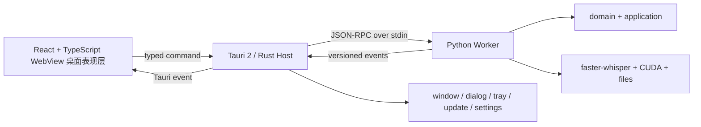

# 下一代架构愿景与技术选型

状态：总体架构 `Accepted`；批次 0–6 已验收，批次 7 正式入口切换与 PyQt5 退役已实现并等待用户最终验收。

## 目标

在保留稳定 Python 转录能力的基础上，更换现有 PyQt5 表现层，获得网页级 UI、现代组件生态、动画交互、可维护的前端工程和更清晰的桌面进程边界。

这不是一次 PyQt5 到 PySide6 的平移，而是表现层和桌面宿主的架构更换。

## 首选方案



### Tauri 2 / Rust 桌面宿主

职责：

- 窗口、托盘、单实例和应用生命周期。
- 文件/目录对话框和拖放入口。
- 启动、监控、重启和关闭 Python Worker。
- IPC 权限、参数校验和事件转发。
- 安装、更新、日志路径和崩溃恢复。

非职责：

- 不实现转录算法。
- 不复制 preset 和后处理规则。
- 不直接操作 faster-whisper。
- 不把 Rust 发展成第二个业务核心。

Tauri 使用系统 WebView，并支持把 Python 可执行程序作为 sidecar 管理：

- <https://v2.tauri.app/concept/architecture/>
- <https://v2.tauri.app/develop/sidecar/>

### React / TypeScript WebView 桌面表现层

建议组合：

- React + TypeScript + Vite。
- Tailwind CSS + 可定制组件系统。
- Motion 处理页面和微交互动画。
- Zustand 管理本地任务与 UI 状态。
- ECharts 展示 CPU/GPU/显存和性能曲线。
- Vitest + React Testing Library + Playwright。

前端只渲染在 Tauri 的内嵌 WebView2 中，并通过类型化 desktop bridge 调用能力，不直接访问 Python、文件系统或任意 shell。交付物是本地桌面 EXE，不是浏览器网站或 localhost WebUI。

### Python 常驻 Worker

复用当前 `domain/application/infrastructure`，新增 headless worker adapter。

职责：

- 环境与模型检查。
- 模型加载、缓存和释放。
- 单个或批量转录。
- preset、后处理和输出。
- 结构化进度、错误、取消和健康状态。

Worker 启动后可复用模型，降低用户连续执行任务时的重复模型加载成本；支持空闲超时释放显存。

## IPC 设计原则

正式桌面通信优先采用 stdin/stdout JSON-RPC，而不是默认打开 localhost HTTP 服务。

每条消息至少包含：

- `schema_version`
- `request_id` 或 `task_id`
- 稳定的 method/event/error code
- 机器可读 data
- 可选的人类可读 message

约束：

- Worker stdout 只输出协议消息。
- 普通日志写 stderr 或滚动日志文件。
- UI 不解析中文展示字符串判断任务状态。
- Tauri 校验消息后再转发给前端。
- 协议演进必须向后兼容或显式升级版本。

建议的第一批方法：

- `system.health`
- `system.environment`
- `model.load`
- `model.unload`
- `transcription.start`
- `transcription.cancel`
- `worker.shutdown`

建议的第一批事件：

- `worker.ready`
- `command.completed`
- `model.loading`
- `model.ready`
- `task.queued`
- `task.progress`
- `task.completed`
- `task.failed`
- `task.cancelled`

## 建议仓库结构

```text
WhisperSubtitle/
├── apps/
│   ├── desktop/                 # Tauri / Rust
│   └── web/                     # React / TypeScript
├── src/
│   └── whisper_subtitle/        # 现有 Python 核心与新 worker adapter
├── contracts/                   # JSON Schema 与生成类型
├── tests/
│   ├── python/
│   ├── protocol/
│   └── e2e/
├── packaging/
├── docs/
└── Log/
```

前端内部按业务功能组织：

```text
apps/web/src/
├── app/
├── features/
│   ├── transcription/
│   ├── task_queue/
│   ├── history/
│   ├── settings/
│   └── diagnostics/
├── components/
├── bridge/
└── styles/
```

## UI 产品愿景

### 主工作台

- 大面积文件拖放区。
- 快速 preset 选择与高级参数抽屉。
- 模型、GPU、显存和环境状态。
- 最近任务和一键继续。

### 任务队列

- 等待、加载模型、转录、后处理、完成和失败状态。
- 单任务取消、重试和打开输出。
- 批量暂停、继续和队列排序。

### 转录详情

- 音频波形与时间轴。
- 实时文本片段。
- 原始文本与后处理文本对照。
- TXT/Markdown/SRT/VTT 导出。
- 后续可增加轻量字幕编辑。

### 性能与诊断

- GPU、显存、CPU、内存曲线。
- 模型加载、推理和后处理耗时。
- 实时倍率和任务统计。
- 一键导出诊断包。

### 视觉原则

- 深色与浅色主题。
- 统一设计 token、字体层级、间距、圆角和颜色。
- 动画用于状态反馈，不堆砌无意义特效。
- 支持键盘、缩放、无障碍和高 DPI。
- 高级感来自一致性、信息层次和细节反馈，而不是过量玻璃和炫光。

## 为什么不是其他方案

| 方案 | 结论 |
| --- | --- |
| PySide6 + Widgets | 更新但没有获得网页前端技术的组件、样式和动效生态 |
| PySide6 + QML | 视觉能力强，但仍是 Qt 技术栈，生态目标不完全匹配 |
| Electron + React | 成熟且开发直接，但携带 Chromium/Node，体积和基础资源更高 |
| Tauri 2 + React | 当前首选；WebView 桌面表现层、轻桌面壳和 Python sidecar 边界匹配 |
| FastAPI + 浏览器 | 适合服务或原型，但桌面生命周期和本机集成较弱 |
| Flet/NiceGUI | 原型速度快，高级定制与长期架构控制不足 |

## 风险

- 技术栈增加为 Python + TypeScript + Rust。
- Tauri sidecar 与 CUDA/Python 大依赖的打包需要专项验证。
- WebView2 运行时和安装器策略需要明确。
- IPC、取消、崩溃恢复和模型生命周期需要先设计后实现。
- 同时重写 UI 和修改转录算法会显著放大风险。

应对策略是分批迁移、保持 Python CLI 可用、保留旧 GUI 回退，并以协议和功能等价测试作为切换门禁。
