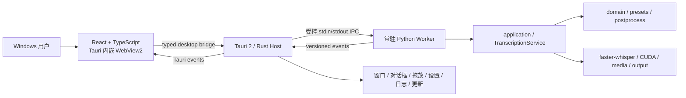

# WhisperSubtitle 下一代桌面架构推动计划书

状态：`Proposed`，等待用户逐批确认后执行。

执行进度：批次 0–6 已完成并获用户验收；批次 7 已将 Tauri EXE 设为唯一桌面入口，保留 Python `transcribe/check/worker` CLI，退役 PyQt5 表现层、VBS 启动器与相关依赖，并通过从零发布、真实 GPU、安装与卸载验证，当前为 `Implementation Complete / User Acceptance Pending`。正式支持范围仅为 Windows 11 x64，Windows 10 不做兼容验证。详见[批次 7 执行报告](批次7-正式切换与PyQt5退役/执行报告.md)。

制定日期：2026-07-15。

输入依据：

- `C:\Users\Administrator\Desktop\工程小想法.txt`
- `Log/20-第二阶段-Tauri桌面架构迁移/新架构愿景与技术选型.md`
- `Log/20-第二阶段-Tauri桌面架构迁移/分阶段迁移路线.md`
- `Log/00-项目记忆/关键决策与用户约束.md`
- 当前代码基线 `0b3a289 refactor: establish modular architecture baseline`
- 当前交接基线 `dc28288 docs: consolidate project records and architecture handoff`

## 一、计划目标

本计划的目标不是把 WhisperSubtitle 改造成浏览器 WebUI，也不是重写已经验证过的转录算法，而是在保留 Python/faster-whisper/CTranslate2/CUDA 核心的前提下，建立现代 Windows 桌面表现层、稳定的进程边界和可以交付到其他电脑的运行形态。

最终产品应满足：

1. 用户双击本地 Windows EXE，在独立桌面窗口内使用。
2. 正式支持范围仅为 Windows 11 x64，不对 Windows 10 做兼容验证。
3. React/TypeScript 只运行在 Tauri 2 内嵌 WebView2 中，不打开外部浏览器，不要求访问 URL。
4. 不使用 Gradio、Streamlit、NiceGUI，不默认启动 FastAPI、localhost HTTP 或 WebSocket 服务。
5. Tauri/Rust 只负责桌面生命周期、系统能力、权限、IPC 和 Python Worker 管理。
6. Python 继续负责模型、CUDA、转录、后处理和输出，不将转录算法重写为 Rust。
7. Python Worker 常驻后复用模型，减少连续任务重复加载模型的时间。
8. 输入支持带双引号路径、文件、文件夹、文件多选和拖放，并统一进入可观察的任务队列。
9. 四个现有处理模式继续作为稳定 preset；用户修改参数后形成可追踪的自定义模式。
10. TXT/Markdown 输出位置和启用状态可以明确配置，同时默认行为不静默偏离当前版本。
11. 提供不依赖目标电脑已安装 Python、Node.js 或 Rust 的 Windows 安装版，并评估完整便携目录版。
12. 新界面达到功能等价、真实 GPU、打包和用户体验验收前，保留 PyQt5 GUI 作为回退入口。

## 二、当前基线与迁移动因

当前工程已经完成模块化重构批次 00–10，存在稳定的：

- `domain/application/infrastructure/presentation` 分层。
- 唯一 `TranscriptionService`。
- 四 preset 单一注册表。
- 中英文纯后处理策略。
- 媒体递归发现、原子输出、CUDA 探测和 faster-whisper 适配器。
- CLI、文本进度、JSONL 进度和 PyQt5 GUI。
- golden、benchmark、真实音频和自动化测试护栏。

当前主要限制是：

- GUI 使用 Qt Widgets，表现力和前端组件生态难以满足下一代交互目标。
- GUI 每次通过 `QProcess` 启动短生命周期 CLI，任务结束后模型随进程释放。
- 当前 `TranscriptionRequest` 表达一个文件或文件夹，不能直接表达用户多选的一组离散文件。
- 当前 JSONL 进度带有中文展示文本，没有版本化 command/event/error 契约。
- 四 preset 参数是固定注册表数据，尚无安全、可验证的用户参数覆盖模型。
- 当前输出策略主要围绕 TXT；Markdown 只在桌面副本模式中生成内容相同的副本。
- 普通 Python venv 依赖基础 Python 和机器相关路径，不能作为真正跨电脑便携运行时。

## 三、将“工程小想法”转化为产品能力

| 原始想法 | 目标能力 | 设计约束 | 验收重点 |
| --- | --- | --- | --- |
| 路径可带双引号 | 输入框接受首尾成对双引号包裹的 Windows 路径 | 只去除一层成对外引号；不执行 shell 拆词；原始文件名不被改写 | 中文、空格、长路径、文件和文件夹均可识别 |
| 选择文件可以多选 | 原生文件对话框多选、拖放、多来源输入队列 | 输入以结构化路径数组传递，不拼接命令行字符串 | 多文件、文件夹、混合输入、去重和稳定顺序 |
| 调整 TXT 和 MD 输出路径 | 建立明确的输出策略和格式开关 | 默认保持现有 TXT 行为；Markdown 是否默认生成需单独确认 | 默认路径、自定义路径、冲突、备份和原子写入 |
| 四模式作为预设，可有自定义模式 | preset 作为不可变基线，用户修改形成派生配置 | 不修改全局 preset；任务记录基础 preset、覆盖项和最终生效参数 | 选择、修改、重置、持久化和任务复现 |
| 参数面板实时交互 | 参数控件由 schema 驱动，实时显示生效参数和校验结果 | 只暴露允许编辑的参数；范围、类型和参数组合必须校验 | 无效值不能启动任务；默认 preset 输出不变 |
| 用网页 UI 技术重做 UI | React/TypeScript WebView 桌面表现层 | 只运行于 Tauri WebView2；不是浏览器 WebUI | 本地 EXE、无外部浏览器、无 localhost 服务 |
| 工程复制到其他电脑可运行 | 安装版与便携版使用自带 Worker 运行时 | 不复制现有 venv；目标机仍需兼容 NVIDIA 驱动和硬件 | 干净 Windows、离线启动、真实 GPU 转录 |

## 四、目标架构



### 4.1 React/TypeScript 表现层

负责：

- 文件、文件夹、多选和拖放交互。
- preset、自定义模式和实时参数面板。
- 输出格式、输出路径和冲突策略界面。
- 任务队列、进度、错误、日志、性能图表和诊断入口。
- 主题、动画、键盘、高 DPI 和无障碍。

不负责：

- 不直接加载 Python 模块或模型。
- 不直接访问任意 shell。
- 不解析中文 message 判断状态。
- 不保存一份独立的 preset 业务真相。

### 4.2 Tauri/Rust 桌面宿主

负责：

- 窗口、单实例、文件对话框、拖放、托盘和应用生命周期。
- 启动、监管、重启和关闭 Python Worker。
- 校验前端命令和 Worker 协议，再进行事件转发。
- 管理应用目录、日志目录、设置、安装和更新能力。

不负责：

- 不实现转录、后处理、preset 或输出内容规则。
- 不直接调用 faster-whisper。
- 不形成第二套 Rust 业务核心。

### 4.3 Python 常驻 Worker

负责：

- 环境检查、模型加载、缓存、释放和健康状态。
- 输入来源展开、任务排队和取消边界。
- 调用现有 Python 应用服务完成转录、后处理和原子输出。
- 返回稳定事件码、机器数据和可选展示文案。
- stdout 只输出协议；普通日志写 stderr 或滚动日志文件。

### 4.4 共享契约

`contracts/` 作为跨语言事实来源，至少包含：

- 协议版本和兼容策略。
- command、event、error 的 JSON Schema。
- 输入来源、输出策略、参数覆盖和任务快照。
- TypeScript 类型和 Python 校验模型的生成或一致性检查。

## 五、关键产品规则

### 5.1 带双引号路径

输入处理规则建议为：

1. 去除用户输入首尾空白。
2. 仅当首尾都是同一对 `"` 时去除一层外引号。
3. 不按空格拆分，不把路径交给 shell 解析。
4. 使用 Windows 路径 API 验证存在性和文件类型。
5. IPC 中传递普通结构化字符串，不传拼接后的命令行。

例如以下内容应解析为一个完整文件路径：

```text
"C:\Users\Administrator\Desktop\Bilibili\课程目录\P20-核心语法-14-整数类型.mp4"
```

### 5.2 多文件与文件夹输入

桌面端统一使用 `InputSource[]` 表达输入，每项至少包含路径和 `file/directory` 类型。建议规则：

- 文件对话框允许多选。
- 文件夹对话框可追加一个或多个目录。
- 拖放、粘贴和对话框结果进入同一个待处理列表。
- 文件夹继续沿用当前“递归发现支持格式并排序”的行为。
- Windows 路径按规范化后的不区分大小写键去重，但保留用户首次加入顺序。
- 单个非法来源显示独立错误，不应悄悄丢弃。
- 同名媒体输出冲突策略必须在执行前确定，不能依赖后写覆盖。

现有 CLI 的单输入语义保持兼容；桌面 Worker 可把输入数组展开为多个内部请求，不要求立即破坏 CLI 参数格式。

### 5.3 preset 与自定义模式

四个现有 preset 继续是受测试保护的不可变基线。建议任务配置表示为：

```text
基础 preset + 用户覆盖项 = 最终生效参数快照
```

交互规则：

- 选择 preset：加载该 preset 的参数，覆盖项为空。
- 修改任何允许编辑的参数：界面状态切换为“自定义”，同时保留其来源 preset。
- “自定义”不是第五套写死的全局参数，而是某个 preset 的派生配置。
- 提供“恢复所选 preset”操作，显式清空覆盖项。
- 任务创建时冻结最终参数快照；之后编辑面板不影响已经排队或执行中的任务。
- 只有用户明确调整参数的任务才允许改变推理参数；默认四 preset 的 golden 不变。

参数面板不应直接暴露任意 faster-whisper kwargs。每个参数需要定义：类型、默认值、合法范围、枚举值、帮助文本、是否需要重载模型、是否影响输出语义。

### 5.4 TXT/Markdown 输出策略

当前兼容行为必须作为默认基线保留：

- 未指定输出目录时，TXT 写入媒体旁的 `Text` 目录。
- 指定输出目录时，主 TXT 写入指定目录，并按当前规则保留源目录备份。
- 当前“桌面输出”会在 `Desktop/Whisper语音列表/Text` 与 `Markdown` 写入内容相同的 TXT/MD。

下一代输出策略建议可以表达：

- TXT 是否启用及其目标根目录。
- Markdown 是否启用及其目标根目录。
- 是否保留源媒体旁 TXT 备份。
- 同名冲突采用报错、自动重命名还是用户确认。
- 打开输出位置和任务完成后的快捷操作。

批次 0 必须确认一个产品决策：TXT 与 Markdown 是共享一个输出根目录并自动分子目录，还是允许分别选择完全独立的目录。在确认前不能改变现有默认输出。

### 5.5 跨电脑运行与便携性

普通 venv 不适合作为跨电脑交付物，原因包括基础 Python 依赖、绝对路径、编译扩展、DLL 和机器环境差异。建议最终提供两种使用同一产物布局的交付形态：

1. Windows 安装版：正式推荐渠道，负责 WebView2 检查、快捷方式、卸载和版本升级。
2. Windows 便携目录版：解压或复制完整目录后运行，不依赖目标电脑预装 Python、Node.js 或 Rust。

建议优先评估 Python Worker 的 `PyInstaller onedir` 或独立嵌入式运行时，而不是复制当前 `whisper_env`，也不优先采用启动慢且 DLL 诊断困难的单文件 Worker。

便携并不意味着完全无外部前提。需要明确：

- 目标机器必须是受支持的 Windows 版本和架构。
- NVIDIA GPU、显存和驱动必须满足 CTranslate2/CUDA 要求。
- WebView2 采用系统 Evergreen Runtime 还是安装包引导安装，需要在批次 0 决策。
- 模型是随包提供、放置在可移动 `models/`，还是由独立离线模型包装入，需要在打包批次验证。
- 运行数据、设置和日志要区分安装模式与便携模式，避免复制工程后仍引用旧电脑绝对路径。

## 六、分批推动路线

每个批次只有在用户明确提示后才能开始。每批只处理列出的范围，默认不提交 Git。

### 批次 0：架构决策与产品基线

目标：冻结现有功能，确认新产品规则，不写新业务实现。

主要工作：

- 编写并确认 Tauri 2 + React/TypeScript + Python Worker ADR。
- 形成当前 PyQt5 功能、设置、错误路径和截图基线。
- 确认双引号路径、多选输入、目录递归、去重和冲突规则。
- 确认自定义模式状态机和首批可编辑参数白名单。
- 确认 TXT/Markdown 输出目录模型。
- 确认 Windows 支持范围、WebView2、Node/pnpm、Rust/Tauri、Python 和 CUDA 版本策略。
- 确认安装版、便携版、Worker 和模型的打包方向。
- 定义逻辑目录和模块所有权，但不创建前端工程。

验收门禁：用户确认 ADR、功能清单、开放决策和迁移边界；生产业务代码不变。

### 批次 1：版本化桌面协议

目标：先稳定机器契约，再实现常驻进程和新 UI。

主要工作：

- 建立 `contracts/` 和协议版本。
- 定义 `InputSource[]`、输出策略、基础 preset、参数覆盖和最终参数快照。
- 定义 `system.health`、`model.load/unload`、`transcription.start/cancel`、`worker.shutdown`。
- 定义 ready、queued、progress、completed、failed、cancelled 等事件及错误码。
- 分离机器字段与中文展示文案。
- 增加 Python/TypeScript 契约一致性和错误路径测试。
- 保持当前 CLI 文本和 JSONL 模式兼容。

验收门禁：schema 和契约测试通过；四 preset、CLI、PyQt5 和 golden 无行为变化。

### 批次 2：常驻 Python Worker 与任务配置

目标：建立长期运行、可复用模型的无 GUI 推理进程。

主要工作：

- 增加独立 Worker 入口和 stdin/stdout 协议循环。
- 实现健康检查、模型缓存、任务启动、取消、关闭和崩溃边界。
- 将多个输入来源展开为稳定任务列表。
- 建立参数白名单、类型/范围校验和派生自定义配置。
- 扩展输出规划以承载经确认的 TXT/Markdown 策略。
- 保持默认 preset 和现有输出路径完全兼容。

验收门禁：连续任务只加载一次模型；坏消息不会污染 Worker；默认四 preset 输出与 golden 一致；CLI 独立可用。

### 批次 3：Tauri/React 工程骨架

目标：建立桌面壳、设计系统和模拟数据界面，暂不连接真实 Worker。

主要工作：

- 创建 `apps/desktop` 和 `apps/web`。
- 配置 React、TypeScript、Vite、测试、lint 和格式化。
- 建立 typed desktop bridge、主题、设计 token、窗口框架和导航。
- 用模拟事件完成输入工作台、任务列表、preset/参数面板和输出策略面板。
- 验证界面只运行于 Tauri WebView2。

验收门禁：开发和生产构建通过；没有 Python Worker 也可预览完整交互；不打开外部浏览器和本地服务端口。

### 批次 4：桌面壳接入真实 Worker

目标：打通 Tauri、Python Worker 和 React 的本地桌面链路。

主要工作：

- Tauri 启动、监管、重启和关闭 Worker。
- 校验协议并将事件转发到前端。
- 接入文件多选、文件夹选择、拖放和带引号路径粘贴。
- 接入 preset、自定义参数、TXT/Markdown 输出策略和任务取消。
- 接入环境检查、日志、完成状态、打开输出目录和退出清理。

验收门禁：新 UI 完成真实中英文、多文件和文件夹转录；输出与既定 golden/规则一致；异常退出不残留 Worker。

### 批次 5：产品体验与诊断

目标：把已经打通的功能提升为稳定、清晰、可长期使用的桌面产品。

主要工作：

- 完整任务队列、失败重试、历史记录和参数快照查看。
- GPU、显存、CPU、内存、模型加载和推理耗时图表。
- 参数说明、风险提示、恢复 preset 和配置导入导出。
- 输出预览、任务详情、主题、动画、键盘、高 DPI 和无障碍。
- 评估波形、时间轴和字幕编辑是否进入后续独立批次。

验收门禁：关键路径 Playwright 测试通过；用户完成视觉、交互和可用性验收。

### 批次 6：Windows 打包、安装与便携验证

执行状态：`Implementation Complete / User Acceptance Pending`（2026-07-16）。当前产物因未提供证书而未签名；自动更新按 P2 保持禁用。验证在同一台 Windows 11 GPU 实机的全新构建环境和冻结运行时中完成，未冒充第二台物理干净机验证。

目标：形成不依赖开发环境的可交付 Windows 应用。

主要工作：

- 确定并实现 Worker onedir/嵌入式运行时方案。
- 分层组织 Tauri 应用、Worker、CUDA DLL、模型、设置和日志。
- 建立安装器、便携目录包、签名、版本、校验和和 SBOM。
- 验证 WebView2、VC Runtime、NVIDIA 驱动和模型路径策略。
- 完成无 Python、Node.js、Rust 开发环境的干净 Windows 验证。
- 验证安装、卸载、升级、目录复制、离线启动和真实 GPU 转录。

验收门禁：目标电脑不安装开发工具也能启动；安装版和便携版均完成真实中英文 GPU 转录；没有旧电脑绝对路径依赖。

### 批次 7：正式切换与 PyQt5 退役

执行状态：`Implementation Complete / User Acceptance Pending`（2026-07-16）。用户明确提示执行批次 7，构成 PyQt5 最终退役的单独确认；所列入口、依赖、回收站与验收工作已完成。

目标：在全部门禁通过后将新 UI 设为正式入口。

切换条件：

- 新 UI 覆盖现有全部必要功能和本计划新增的 P0 能力。
- 四 preset、自定义模式、多输入、输出策略、取消和失败路径通过。
- golden、真实 CUDA、批处理、设置、关闭和崩溃恢复通过。
- 安装、便携、升级和卸载通过。
- 用户完成视觉和交互验收。

执行内容：

- 将 Tauri 应用设为默认桌面入口。
- 继续保留 Python CLI。
- 经用户单独确认后，将 PyQt5 表现层移动到 Windows 回收站。
- 删除 PyQt5 依赖和专属测试，更新当前架构与发布资料。

## 七、优先级与范围控制

### P0：正式切换前必须完成

- 本地 Tauri WebView 桌面壳。
- 稳定版本化 IPC。
- 常驻 Worker 和模型复用。
- 带引号路径、文件多选、文件夹和拖放。
- 四 preset 与受校验的自定义模式。
- 可确认的 TXT/Markdown 输出策略。
- 安装版、便携性验证和 PyQt5 回退。
- 四 preset golden、真实 CUDA 和失败路径门禁。

### P1：强烈建议随新 UI 完成

- 任务历史、失败重试、参数快照和诊断包。
- 性能图表、主题、键盘、高 DPI 和无障碍。
- 配置导入导出和打开输出目录。

### P2：后续独立评估

- 波形、时间轴、字幕编辑和更多导出格式。
- 自动更新。
- 模型下载或模型管理中心。
- macOS/Linux 支持。

P2 不得阻塞 P0 的正确性和 Windows 交付，也不得顺手塞入较早批次。

## 八、验收矩阵

| 范围 | 必测场景 |
| --- | --- |
| 路径 | 无引号、成对引号、空格、中文、长路径、文件、文件夹、不存在、格式不支持 |
| 多输入 | 多文件、多个目录、文件与目录混合、重复来源、稳定顺序、部分来源失败 |
| preset | 四 preset 默认值、切换、恢复、历史设置迁移 |
| 自定义模式 | 单参数修改、多参数修改、非法类型、越界、组合冲突、任务参数快照 |
| 输出 | 当前默认 TXT、自定义 TXT、Markdown 开关/路径、源目录备份、同名冲突、原子替换 |
| IPC | 未知方法、坏 JSON、版本不兼容、重复 request ID、Worker stderr、Worker 崩溃 |
| Worker | 首次加载、连续任务复用、取消、空闲释放、关闭、重启、GPU 错误 |
| 桌面壳 | 文件对话框、拖放、退出清理、单实例、设置恢复、无外部浏览器、无监听端口 |
| 回归 | Python 全量测试、协议测试、前端测试、Playwright、四 preset golden、真实中英文 CUDA |
| 交付 | 无 Python/Node/Rust 的干净 Windows、安装/卸载/升级、便携目录复制、离线运行 |

## 九、全局禁止事项

- 不在 UI 或进程迁移中顺手修改转录算法、preset 默认值、后处理、文件命名或输出内容。
- 不将 Python 推理逻辑重写到 Rust。
- 不以浏览器页面或 localhost 服务代替正式桌面窗口。
- 不让前端直接执行任意 shell 或绕过 Tauri 权限边界。
- 不让 UI 依赖解析中文 message 决定业务状态。
- 不删除现有 PyQt5 GUI，直到全部切换门禁和用户验收完成。
- 不复制现有 venv 充当便携运行时证据。
- 不使用复制旧环境代替依赖、CUDA 或打包的从零验证。
- 不修改、删除、移动或清理 `.workbuddy` 和现有 Agent 本地配置。
- 不恢复或重新创建 `.planning`。
- 删除文件时只移动到 Windows 回收站，不永久删除。
- 未经用户明确要求，不执行 Git 暂存、提交、创建分支、推送、打标签或发布。
- 每次只执行一个用户明确指定的批次，不跨批次顺手实现。

## 十、风险与应对

| 风险 | 影响 | 应对 |
| --- | --- | --- |
| Python/TypeScript/Rust 三栈增加复杂度 | 调试和发布链路变长 | 以版本化契约隔离，Rust 保持轻量，分批建立测试 |
| sidecar 与 CUDA DLL 打包复杂 | 开发机可用但目标机失败 | 批次 6 使用干净 Windows 和真实 NVIDIA GPU 验证 |
| 多输入导致同名输出覆盖 | 数据丢失 | 执行前规划全部目标路径并应用明确冲突策略 |
| 自定义参数破坏稳定输出 | golden 漂移或推理失败 | 白名单、范围校验、参数快照；默认 preset 不变 |
| 路径引号和空格被错误解析 | 文件无法打开 | 全程结构化路径，不经过 shell，不手工拼命令行 |
| Worker stdout 被日志污染 | IPC 解析失效 | stdout 仅协议，stderr/文件承载日志，增加坏消息测试 |
| UI 重做范围持续膨胀 | 推迟可交付版本 | P0/P1/P2 分级；波形和编辑器独立评估 |
| 过早删除 PyQt5 | 失去稳定回退入口 | 功能等价、GPU、打包和用户验收后才退役 |

## 十一、总体完成标准

当且仅当以下条件全部满足，下一代架构迁移才可视为完成：

1. 产品是本地 Windows EXE，React 只运行在内嵌 WebView2 中。
2. 没有外部浏览器、用户 URL、默认 localhost HTTP/WebSocket 服务。
3. Python Worker 常驻并能在连续任务间复用模型。
4. 路径、文件多选、文件夹、拖放和错误提示达到本计划定义。
5. 四 preset 默认行为不变，自定义模式参数经过验证并可复现。
6. TXT/Markdown 输出位置、格式和冲突规则经用户确认并有测试。
7. Python CLI 继续可用，Tauri/Rust 没有复制转录业务。
8. Python、协议、前端、E2E、golden、真实中英文 CUDA 全部通过。
9. 安装版和便携目录版在无开发环境的干净 Windows 上通过验证。
10. 新 UI 达到功能等价并完成用户视觉与交互验收。
11. `.workbuddy`、用户本地配置和历史证据未被破坏。
12. PyQt5 只有在用户单独确认后才进入回收站并退出正式入口。

## 十二、下一步建议

批次 0–6 已完成并获用户验收；批次 7 的正式 Tauri 入口、PyQt5 退役、依赖清理、从零发布、真实 GPU、安装和卸载已经实现，当前等待用户最终验收。实时片段、波形、时间轴与字幕编辑仍未实施；自动更新保持 P2 禁用。

本推动计划没有批次 8。批次 7 获用户最终验收后，任何新功能、正式签名、自动更新或发布操作都必须另行明确范围和授权。
