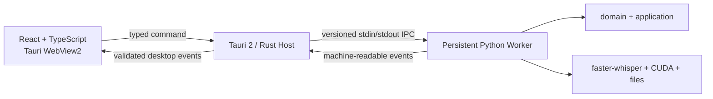

# ADR-0001: Tauri 2 + React/TypeScript + Python Worker 桌面架构

- 状态：`Accepted`
- 决策日期：2026-07-15
- 实现状态：`Implemented`；协议、Worker、Tauri/React 桌面、真实 Host/Worker 接线、产品体验、发布 sidecar、离线安装器、便携目录、默认入口切换和 PyQt5 退役均已在批次 1–7 实现；批次 7 等待用户最终验收
- 决策范围：下一代 Windows 桌面表现层与进程边界

## 背景

WhisperSubtitle 当前是经过真实 CUDA、golden 和自动化测试保护的 Python 模块化桌面应用。现有 PyQt5 GUI 通过 `QProcess` 启动短生命周期 canonical CLI；每次任务结束后进程和模型一起退出。

下一阶段需要现代网页前端技术的界面表现力、稳定的桌面生命周期、模型复用和可交付 Windows EXE，但不需要浏览器 WebUI，也不应为了 UI 迁移重写 Python 转录核心。

## 决策

采用以下目标架构：

### 桌面形态

- 正式产品是本地 Windows EXE。
- 正式支持范围仅为 Windows 11 x64；Windows 10 不支持且不做兼容验证。
- React/TypeScript 仅渲染于 Tauri 内嵌 WebView2。
- 不打开外部浏览器，不要求用户访问 URL。
- 不使用 Gradio、Streamlit、NiceGUI。
- 不默认启动 FastAPI、localhost HTTP 或 WebSocket 服务。

### 职责边界

- React/TypeScript：视图、交互、动画、任务状态、主题、图表和可访问性。
- Tauri/Rust：窗口、原生对话框、权限、生命周期、IPC 校验、Worker 监管和安装边界。
- Python Worker：模型、CUDA、转录、后处理、输出、健康状态和结构化任务事件。
- 现有 Python `domain/application/infrastructure`：继续作为业务和推理事实来源。

Rust 不实现转录算法，不复制 preset 和后处理规则，不直接操作 faster-whisper。前端不得直接执行任意 shell，也不得通过解析中文展示字符串判断状态。

### 进程与 IPC

- Tauri 以受控 sidecar 方式启动一个常驻 Python Worker。
- 正式协议优先使用 stdin/stdout 上的版本化 JSON 消息。
- Worker stdout 只输出协议；日志写 stderr 或滚动日志文件。
- Tauri 校验 Worker 消息后再向前端转发。
- 文件路径以结构化字符串字段传递，不拼接 shell 命令。
- 协议 schema、command/event/error code 在批次 1 实现，本 ADR 不创建运行时代码。

Tauri 官方将外部可执行文件称为 sidecar，并明确支持把 Python CLI/PyInstaller 产物作为外部二进制嵌入；sidecar 权限需通过 capabilities 精确声明。

### 回退与切换

- Python CLI 始终保持可用。
- PyQt5 GUI 在新界面完成必要功能等价、golden、真实 CUDA、打包和用户验收前保留。
- 用户已明确提示执行批次 7，PyQt5 表现层与专属测试按约束进入 Windows 回收站；Python CLI 保留。

## 结果

正面结果：

- 复用稳定 Python 核心，不扩大算法回归面。
- 获得 React/TypeScript 的组件、样式、动画和测试生态。
- 常驻 Worker 可以复用模型并形成清晰的崩溃、取消和关闭边界。
- Tauri 权限和 sidecar 管理比开放本地服务端口更符合单机离线产品。

代价与风险：

- 工程增加 TypeScript 和 Rust 两种语言。
- Worker、CUDA DLL、模型和 WebView2 的打包需要独立验证。
- 跨语言契约必须版本化，并维护一致性测试。
- 新旧 GUI 共存期间需要明确入口和回退策略。

## 批次 6 落地决定

- Worker 使用 PyInstaller 6.21.0 onedir，显式排除 Tk 和测试依赖；批次 7 后发布依赖中已不存在 PyQt5。
- 模型使用 setup 相邻的直接离线快照；安装钩子校验、复制并在卸载时移除安装目录内模型。
- WebView2 使用 NSIS `offlineInstaller`；安装范围为 current-user。
- 发布同时提供完整便携目录、manifest、SHA-256 和 CycloneDX Python SBOM。
- 自动更新保持 P2 禁用；稳定 identifier 的离线覆盖升级已验证。
- 当前产物没有 Authenticode 签名，因为未提供证书；签名配置入口已实现。

TXT/Markdown 输出模型、参数白名单、Windows 11 x64 支持范围、Evergreen WebView2、NSIS offlineInstaller 和 PyInstaller onedir 已在批次 0 获用户验收并在批次 6 落地；批次 7 经单独授权完成入口切换和 PyQt5 退役。不得扩展正式平台范围。

## 被拒绝或暂不采用的方案

- 深度重做 PyQt5/PySide6 Widgets：不能满足网页前端技术生态目标。
- Electron + React：可行，但当前优先选择更轻的 Tauri 桌面宿主。
- FastAPI + 浏览器：不符合本地独立桌面窗口和受控 IPC 目标。
- Gradio/Streamlit/NiceGUI：不作为正式产品表现层。
- Rust 重写推理核心：收益不足且显著放大回归风险。

## 参考

- [Tauri 2 prerequisites](https://v2.tauri.app/start/prerequisites/)
- [Tauri 2 embedding external binaries](https://v2.tauri.app/develop/sidecar/)
- [Tauri 2 Windows installer](https://v2.tauri.app/distribute/windows-installer/)
- [Microsoft WebView2 distribution](https://learn.microsoft.com/en-us/microsoft-edge/webview2/concepts/distribution)
