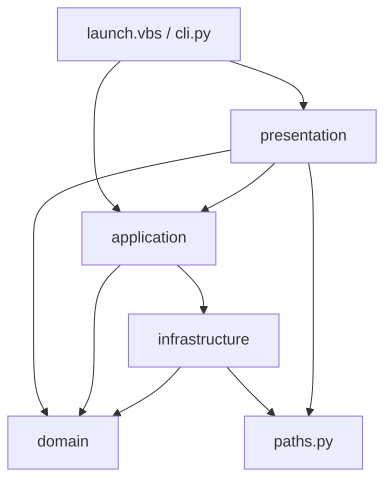

# 当前架构

## 总览

工程采用实用型分层架构：domain 保存纯业务契约和规则；infrastructure 封装硬件、模型和文件系统；application 编排单次或批量转录；presentation 适配 CLI/JSONL/GUI；根级 CLI 和启动器负责进程入口与组合。



## 模块职责

```text
src/whisper_subtitle/
├── application/
│   └── transcribe.py          # 唯一转录用例与批处理编排
├── domain/
│   ├── contracts.py           # Preset、请求、结果、进度事件
│   ├── presets.py             # 四 preset 的唯一注册表
│   ├── transcription.py       # 引擎协议
│   └── postprocess/           # 纯文本与片段后处理
├── infrastructure/
│   ├── cuda_runtime.py        # Windows CUDA wheel DLL 适配
│   ├── environment_check.py   # 运行环境检查
│   ├── hardware.py            # CTranslate2/NVML 硬件探测
│   ├── media_files.py         # 媒体发现
│   ├── output_store.py        # 原子输出与路径规划
│   └── whisper_engine.py      # faster-whisper 适配器
├── presentation/
│   ├── console.py             # 文本/JSONL 进度适配
│   └── gui/                   # 窗口、控制器、进程和组件
├── resources/                 # 可安装包资源
├── bootstrap.py               # 模型缓存等进程配置
├── paths.py                   # 安装/便携路径解析
├── cli.py                     # 统一命令入口
└── __main__.py                # python -m 入口
```

## 依赖规则

- domain 不导入 application、infrastructure、presentation、GUI 或具体推理库。
- infrastructure 可以实现 domain 协议，但 domain 不反向引用实现。
- application 只编排请求、preset、引擎、媒体和输出，不包含 PyQt 控件或控制台格式。
- presentation 只处理输入、进度展示和进程交互，不复制转录流程。
- preset 只描述业务参数和后处理策略，不绑定 Python 脚本文件。
- 任何本地模型、虚拟环境和工作目录均通过 `AppPaths` 解析，不从源码层级反推项目根目录。

这些规则由 `tests/test_architecture.py` 自动验证关键边界。

## 转录流程

```text
CLI/GUI 输入
  → TranscriptionRequest
  → TranscriptionService
  → 解析 preset
  → 发现媒体
  → HardwareDetector + FasterWhisperEngine
  → engine.transcribe
  → domain.postprocess strategy
  → output_store 原子写入
  → ProgressEvent / BatchResult
```

CLI 和 GUI 共用同一 `TranscriptionService`；四个 preset 只改变注册表参数和后处理策略。

## 运行与发布边界

- 便携模式：`launch.vbs` 自动寻找解释器，模型可放在工程 `models/huggingface`。
- 安装模式：console script 为 `whisper-subtitle`，资源通过 `importlib.resources` 读取。
- CUDA：CTranslate2 判断能力，NVML 提供元数据，`nvidia-cublas-cu12` 提供 Windows 原生运行时。
- GUI 子进程使用 `python -m whisper_subtitle transcribe --progress jsonl`，不调用物理脚本。
