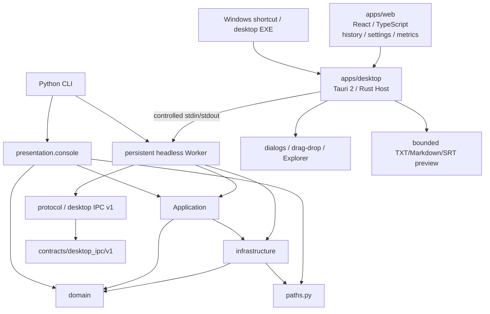

# 当前架构

## 总览

工程采用实用型分层架构：domain 保存纯业务契约和规则；infrastructure 封装硬件、模型和文件系统；application 编排单次或批量转录；presentation 适配 CLI/JSONL；worker 适配长期运行的 Desktop IPC；Tauri/React 负责正式桌面表现层与进程宿主。

新架构批次 2 已增加 `python -m whisper_subtitle worker`、stdin/stdout 协议循环、串行任务队列、取消、模型缓存/空闲释放和可配置输出。批次 3 建立 Tauri 2 / React/TypeScript WebView2 桌面骨架；批次 4 已通过受控子进程、严格协议校验和 typed Tauri bridge 连接该 Worker；批次 5 增加版本化设置、任务历史与重试、真实性能趋势、受限输出预览和可访问交互；批次 6 增加 PyInstaller onedir Worker、NSIS 离线安装介质和完整便携目录；批次 7 将 Tauri EXE 设为唯一桌面入口并退役 PyQt5 与 VBS 启动层。



Tauri Host 是 WebView 与 Worker 之间唯一的运行时边界：前端不能直接启动进程，Worker 消息必须先通过 Rust 的 Desktop IPC v1 校验。普通浏览器测试仍绑定 mock bridge，但 Tauri production 运行时绑定真实 bridge。

## 模块职责

```text
src/whisper_subtitle/
├── application/
│   ├── transcribe.py          # 唯一转录用例与批处理编排
│   └── recognition_passes.py  # 混合语言/中文细节复核阶段
├── domain/
│   ├── contracts.py           # Preset、请求、结果、进度事件
│   ├── presets.py             # 四 preset 的唯一注册表
│   ├── transcription.py       # 引擎协议
│   └── postprocess/           # 纯文本与片段后处理
├── infrastructure/
│   ├── cuda_runtime.py        # Windows CUDA wheel DLL 适配
│   ├── environment_check.py   # 运行环境检查
│   ├── hardware.py            # CTranslate2/NVML 硬件探测
│   ├── media_files.py         # 媒体发现
│   ├── output_store.py        # TXT/Markdown/SRT 原子输出与路径规划
│   ├── performance.py         # CPU/内存/NVML 只读性能采样
│   └── whisper_engine.py      # faster-whisper 适配器
├── presentation/
│   └── console.py             # 文本/JSONL 进度适配
├── protocol/
│   ├── desktop_ipc.py         # v1 command/event/error、解析与生命周期
│   ├── desktop_ipc_validation.py # 公共字段与事件结构校验
│   └── desktop_ipc_quality.py # 质量诊断结构校验
├── worker/
│   ├── runtime.py             # 常驻生命周期、队列和命令分发
│   ├── task_execution.py      # 单任务执行与输入/输出适配
│   ├── runtime_types.py       # Worker 共享类型、错误和默认引擎加载器
│   ├── model_cache.py         # 模型复用与空闲释放
│   ├── task.py                # 队列任务快照
│   └── stdio.py               # UTF-8 stdin/stdout JSON-lines 传输
├── resources/                 # 可安装包资源
├── bootstrap.py               # 模型缓存等进程配置
├── paths.py                   # 安装/便携路径解析
├── cli.py                     # 统一命令入口
└── __main__.py                # python -m 入口

apps/
├── web/                       # React WebView、持久化工作台、趋势与 typed bridge
│   └── src/bridge/             # Tauri 调用、Worker 解码与事件归并
└── desktop/src-tauri/         # Tauri Host、协议校验、受限预览与 Worker 监管
```

## 依赖规则

- domain 不导入 application、infrastructure、presentation、桌面表现层或具体推理库。
- infrastructure 可以实现 domain 协议，但 domain 不反向引用实现。
- application 只编排请求、preset、引擎、媒体和输出，不包含桌面组件或控制台格式。
- presentation 只适配 CLI 输入与文本/JSONL 进度展示，不复制转录流程。
- protocol 不依赖桌面框架、faster-whisper 或具体传输，只表达版本化机器契约。
- worker 组合 protocol、application、domain 和 infrastructure，stdout 只输出协议，普通日志写 stderr。
- apps/web 组件只依赖 typed `DesktopBridge`；Tauri adapter 集中封装白名单 command/event，组件不直接导入 Python或任意 shell。
- apps/desktop 只加载本地静态 WebView 资源，CSP 的 `connect-src 'none'` 保持不变；Rust 只开放精确桌面 command，不开放通用 shell 或网络权限。
- apps/desktop 负责 Worker 进程和 Desktop IPC v1 校验，不实现 preset、转录、后处理或输出内容规则。
- 默认输出把 TXT、Markdown、SRT 文件直接写入各媒体旁的 `Text`、`Markdown`、`SRT` 文件夹；自定义根目录使用同名一级文件夹，并可分别选择是否额外保留媒体旁 TXT/Markdown 副本，不再把两种副本绑定为同一个开关。
- preset 只描述业务参数和后处理策略，不绑定 Python 脚本文件。
- 任何本地模型、虚拟环境和工作目录均通过 `AppPaths` 解析，不从源码层级反推项目根目录。

这些规则由 `tests/test_architecture.py` 自动验证关键边界。

## 转录流程

```text
CLI 或 Desktop IPC 输入
  → TranscriptionRequest
  → TranscriptionService
  → 解析 preset
  → 发现媒体
  → HardwareDetector + FasterWhisperEngine
  → engine.transcribe
  → domain.postprocess strategy
  → output_store 原子写入
  → ProgressEvent / BatchResult
```

CLI 和 Worker 共用同一 `TranscriptionService`；四个 preset 只改变注册表参数和后处理策略。`domain/presets.py` 是参数事实源，Web 参数编辑器消费由 `scripts/generate_preset_catalog.py` 生成的 TypeScript 投影。

Worker 流程为：

```text
Desktop IPC command
  → WorkerRuntime 冻结输入、派生 preset、输出计划
  → 单 dispatcher 串行执行任务
  → ModelCache 首次加载/连续复用/空闲释放
  → TranscriptionService + 可选取消检查点
  → Desktop IPC task events / command.completed / error
```

Web 工作台的事件归并位于 `apps/web/src/state/workspaceEvents.ts`，任务状态纯函数位于 `workspaceTaskState.ts`；外观偏好、性能指标、草稿归一化和持久化分别位于 `state/appearancePreferences.ts`、`state/performanceMetrics.ts`、`state/workspaceDraft.ts`、`state/workspacePersistence.ts`。Tauri Worker 的字段解码位于 `bridge/tauriWorkerDecoder.ts`，任务事件到桌面事件的归并位于 `bridge/tauriWorkerEvents.ts`，正式 bridge 只负责 Tauri invoke、订阅、轮询和生命周期。Rust Host 的模型目录、媒体辅助、日志诊断和启动 draft 校验分别位于 `worker_host/models.rs`、`worker_host/media.rs`、`worker_host/logs.rs`、`worker_host/validation.rs`；Rust Desktop IPC 的质量诊断校验位于 `protocol_quality.rs`。

## 运行与发布边界

- 默认桌面入口：安装版使用 Windows 快捷方式或安装目录 `whisper-subtitle-desktop.exe`；便携版直接运行同名 EXE。VBS 启动层已退役。
- 便携模式：完整目录包含桌面 EXE、Worker、CUDA 运行时和直接模型快照。
- 安装模式：console script 为 `whisper-subtitle`，资源通过 `importlib.resources` 读取。
- CUDA：CTranslate2 判断能力，NVML 提供元数据，`nvidia-cublas-cu12` 提供 Windows 原生运行时。
- `contracts/desktop_ipc/v1/desktop_ipc.schema.json` 是桌面 IPC v1 的跨语言事实来源；Python 枚举、Worker 消息与 schema 由契约测试保持一致。
- 当前 CLI `type: progress` JSONL 是保留的机器输出通道，不属于 desktop IPC v1；PyQt5 消费者已在批次 7 退役。
- `python -m whisper_subtitle worker` 是无 GUI 常驻入口；它不打开端口、浏览器或 localhost 服务。
- Tauri/React 桌面应用直接加载 `apps/web/dist`，不设置 `devUrl`，不监听 localhost；Host 通过受控 stdin/stdout 监管 Worker。
- `system.metrics` 是 Desktop IPC v1 的只读诊断 command；它使用 psutil/NVML 采样，不改变模型状态，失败不影响转录。
- WebView 使用带版本号的 localStorage 保存设置和最多 100 条任务；这是本机桌面状态，不是浏览器 WebUI 后端或服务端数据库。
- Rust `read_output_preview` 只允许规范化后的 `.txt`/`.md`/`.srt` 文件并限制为前 128 KiB，不暴露通用文件读取。
- Playwright 可以在测试期间临时使用 `127.0.0.1` 提供静态构建产物；该测试基础设施不进入 production runtime。
- 开发态 Host 可使用显式 Python 或工程 `whisper_env`；发布态 Host 从应用目录解析 `worker/whisper-subtitle-worker.exe`，并向 Worker 注入应用根目录和直接模型快照路径。
- 正式安装介质为 NSIS current-user setup 与相邻 `models/large-v3-turbo/` 的两部分离线布局；setup 内置 WebView2 Evergreen offlineInstaller，不依赖网络安装。
- 完整便携目录包含桌面 EXE、Worker、CUDA 用户态依赖、模型和 distribution 元数据；目标运行时不需要 Python、Node.js 或 Rust。
- 发布清单、SHA-256 和 CycloneDX Python SBOM 位于 `dist/release/`。当前产物未签名；自动更新未启用，NSIS 覆盖升级已验证。
